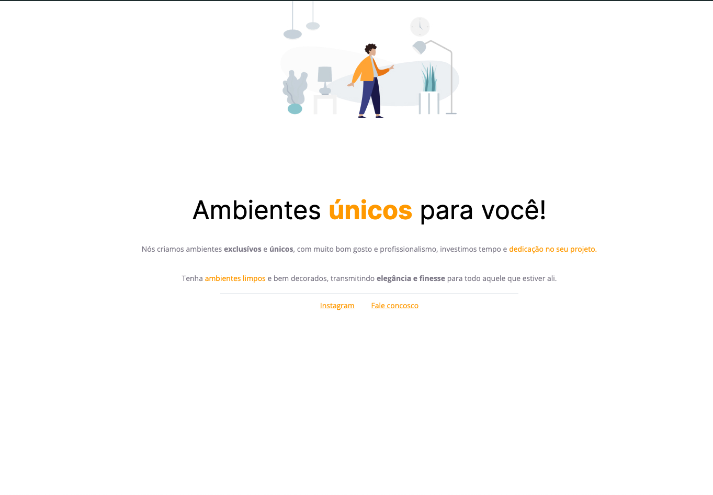

  

  
  
  

  

## 🧪 Technologies

This project was developed using the following technologies:

- HTML
- CSS

## 📝 License

This project is licensed under the MIT License. See the [LICENSE](LICENSE) file for details.

---

Made with 💜 by [birobirobiro](https://www.birobirobiro.dev) 👋
